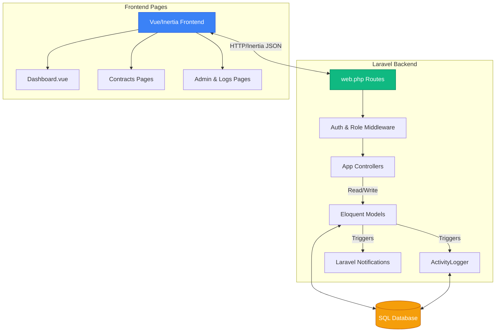

# Contract Management System (CMS) - Technical Documentation

## Overview
The Contract Management System (CMS) is a government-grade, secure, role-based web application built to manage the entire lifecycle of corporate and institutional contracts. It features a zero-trust security model, granular Role-Based Access Control (RBAC), and comprehensive audit logging.

### Architecture Stack
*   **Frontend:** Vue.js 3 (Composition API), Inertia.js, Tailwind CSS v4, Lucide Icons.
*   **Backend:** Laravel 11 (PHP 8.2+), PostgreSQL/SQLite.
*   **Security & Permissions:** Spatie Laravel-Permission, Spatie Activitylog (immutable audit trails).

---

## 1. System Data Flow & Architecture Diagram

**Flow Description:**
1.  **Request Initiation:** The user interacts with the Vue.js frontend (e.g., clicking "Save Contract").
2.  **Inertia Bridge:** Inertia.js intercepts the click and sends an XHR request to the Laravel backend.
3.  **Routing & Middleware:** `web.php` receives the request. The `auth` and `role` middlewares verify the user's identity and permissions (e.g., ensuring only 'Head' can approve).
4.  **Controller Logic:** The appropriate Controller processes the request, validates the input, and interacts with Eloquent Models.
5.  **Database & Audit:** The Model updates the database. Spatie Activitylog automatically hooks into the Model events to record an immutable audit trail.
6.  **Response:** Laravel returns an Inertia response containing the updated JSON data. Vue automatically patches the DOM without a full page reload.

---

## 2. Frontend Architecture (Vue.js + Inertia)

The frontend uses Inertia.js to act as a modern Single Page Application (SPA) while relying on Laravel for routing.

### 2.1 Core Layouts & Components

#### `AuthenticatedLayout.vue`
*   **Purpose:** The main shell wrapping all authenticated pages.
*   **Key Features:** Manages the overall CSS grid, responsive states, and wraps the Sidebar and TopNav components.
*   **Interactions:** Injects the shared Inertia page props (auth user) down to its children.
*   **UI/UX Notes:** Uses a dual-sidebar layout on desktop, collapsing to a hamburger menu on mobile. Implements smooth transitions for route changes.

#### `Sidebar.vue` & `TopNav.vue`
*   **Purpose:** Primary system navigation and contextual tools.
*   **Key Features:**
    *   **Sidebar:** Lazily computed navigation items based on the user's role array (`isAdmin`, `isHead`, `isOfficer`) to prevent rendering routes the user lacks permission to access.
    *   **TopNav:** Contains the global search bar, dark/light mode toggle, and the real-time Notification bell dropdown.
*   **Data Flow:** TopNav connects to the `/api/search` and `/api/notifications` endpoints asynchronously to fetch dropdown data without obstructing page loads.

---

### 2.2 Functional Pages (Views)

#### `Dashboard.vue`
*   **Purpose:** The operational command center customized dynamically for the authenticated user's role.
*   **Key Features:** Renders entirely different widgets based on role.
    *   *Admin:* Views recent server logins, deactivated users, active session counts, and system management shortcuts.
    *   *Head:* Views contracts pending approval, expiration timelines, and recent system activity.
    *   *Officer:* Views their draft portfolio, active contracts, and quick-action buttons.
*   **Data Flow:** Receives massive pre-aggregated stats objects directly from `DashboardController`.
*   **UI/UX Notes:** High aesthetic focus using modern glassmorphism, animated pulse indicators for system status, and complex grid layouts.

#### `Contracts/Index.vue`
*   **Purpose:** The central registry listing all active, pending, and draft contracts.
*   **Key Features:** Role-scoped visibility (Heads see all, Officers see own). Includes complex filters (Status, Priority) and live global search.
*   **Data Flow:** Uses Inertia router to append query parameters (`?status=active&search=query`). Preserves scroll state.
*   **UI/UX Notes:** Uses visual color-coding based on the `priority_level` (Sensitive=Red, High=Orange, etc.) via dynamic Tailwind border classes.

#### `Contracts/Show.vue`
*   **Purpose:** The detailed view of a single contract's lifecycle, clauses, and installments.
*   **Key Features:**
    *   **Tabbed Interface:** Splits complex data into Overview, Clauses, Installments, and History tabs.
    *   **Role-Based Actions:** Displays "Approve" / "Reject" / "Terminate" buttons exclusively to Head users, and "Submit" to Officers.
*   **Interactions:** Submits highly specific POST requests to transition contract states (e.g., `contracts/{id}/approve`).

#### `Contracts/Create.vue`
*   **Purpose:** Multi-section form for registering new institutional contracts.
*   **Key Features:** Client-side dynamic date calculation (automatically determining exact expiration dates based on duration logic). Dynamic arrays for adding multiple financial installments and compliance clauses.
*   **Data Flow:** Uses Inertia's `useForm` hook to handle CSRF tokens, validation error tracking, and progress bar indication automatically.

#### `Admin/Logs.vue` (Shared across Roles)
*   **Purpose:** The immutable audit trail viewer.
*   **Key Features:** Displays raw system activity including IP addresses, User Agents, affected models, and exact timestamps.
*   **Interactions:** Reused by `Head/Logs.vue` and `Officer/Logs.vue` wrappers to provide the exact same UI but with securely scoped, role-restricted data.

---

## 3. Backend Architecture (Laravel)

The backend operates as a strictly REST-like endpoint provider using Inertia's JSON bridging, protected by robust Spatie middleware.

### 3.1 Routing & Security (`web.php`)
*   **Purpose:** Defines all application entry points and enforces gatekeeping.
*   **Key Features:** Uses `Route::middleware('role:Admin')` to create impenetrable boundaries.
*   *Security Note:* A user manually typing a URL for a different role (e.g., an Officer typing `/admin/users`) is physically blocked at the routing layer, returning a 403 Forbidden before reaching a controller.

### 3.2 Core Controllers

#### `LoginController.php`
*   **Purpose:** Handles authentication and session management.
*   **Key Features:** Logs custom Audit events (Capturing IP and User-Agent) upon successful login. Implements `throttle:6,1` to prevent brute-force attacks.

#### `DashboardController.php`
*   **Purpose:** Aggregates complex analytics for the frontend Dashboard.
*   **Data Flow:** Checks the user's exact role using `$user->hasRole()` and performs highly optimized, eager-loaded Eloquent queries to count pending approvals, expiring contracts, etc.

#### `ContractController.php`
*   **Purpose:** The core CRUD and state-machine controller for the system's primary entity.
*   **Key Features:**
    *   Provides standard `index`, `store`, `update`, `show` methods.
    *   Provides State-Machine methods: `submit()`, `approve()`, `reject()`, `terminate()`, `close()`.
    *   Eager loads complex relationships (`creator`, `approver`, `complianceClauses`, `installments`) to prevent N+1 frontend query problems.

#### `SearchController.php`
*   **Purpose:** Provides global Search-as-you-type capabilities.
*   **Interactions:** Called heavily via async `fetch` from the `TopNav.vue` component. Returns JSON arrays of contracts matched by `contract_name`, `contract_number`, or `awarded_to`.

#### `AuditLogController.php` & `UserController.php`
*   **Purpose:** Admin/Head oversight and system management.
*   **Key Features:** Exports data via PDF. `UserController` allows Admins to securely update passwords, manage roles, and force-logout compromised accounts.

### 3.3 Database Models & Integrity

#### `Contract` Model
*   **Purpose:** The central data structure holding metadata.
*   **Key Features:**
    *   Defines strict constants (`STATUS_DRAFT`, `STATUS_PENDING_APPROVAL`, `STATUS_ACTIVE`).
    *   Has relationships: `hasMany(ComplianceClause::class)`, `hasMany(Installment::class)`.
    *   Uses Spatie `LogsActivity` trait to automatically hook into `created`, `updated`, and `deleted` events, ensuring every state change is logged without manual intervention.

#### `User` Model
*   **Purpose:** Extends basic Laravel Auth with the Spatie `HasRoles` trait.
*   **Data Flow:** Provides helper methods to check authorization levels seamlessly throughout both Blade/Inertia injection and backend logic.

---

## 4. Key Workflows & Features

### 4.1 The Contract State Machine
Contracts move through a rigid, automated lifecycle:
1.  **Draft:** Officer creates. Only they and Heads can see it.
2.  **Pending Approval:** Officer hits 'Submit'.
3.  **Active:** Head reviews and hits 'Approve'. An automated `ContractExpiring` Notification is generated and queued to trigger when the expiry date approaches.
4.  **Terminated / Closed:** Head marks the contract as finished.

### 4.2 Immutable Audit Logging
Any change to a Contract, User, or System setting triggers the `ActivityLogger`. The backend saves:
*   The `old` properties versus the `new` properties (JSON diff).
*   The exact authenticated User ID making the change.
*   Network Data (IP).
This ensures legal compliance and trace-ability for all operations.
